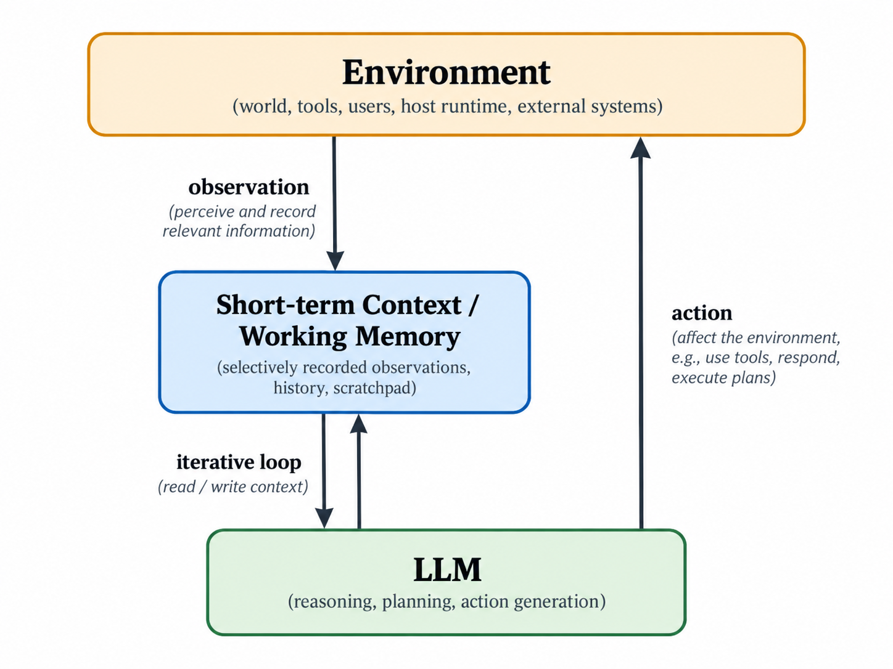

## 1.介绍

1.1 Current Loop-Agent Paradigm

P1 — 当前范式定义
介绍本文使用的描述性术语 Loop Agent：许多当前 Agent 系统可以抽象为“LLM + 外部维护的短期上下文 + 环境交互”的迭代结构。LLM 本身每次调用仍是离散推理，任务连续性主要依赖外部保存并重新提供的 context。

P2 — Context 的作用
Short-term Context / Working Memory 保存与下一轮推理相关的信息，例如用户输入、历史输出、工具结果、环境观测和 scratchpad。它不是环境真实状态本身，而是 LLM 可见状态的一个选择性投影。

Figure 1 — Loop-Agent Interaction Model
图中表达：

        Environment
      ↙             ↖
observation       action
    ↓               ↑
Short-term Context ↔ LLM
        iterative loop

图片索引：

P3 — Loop 的真正位置
强调 loop 的核心不是“LLM 与工具不断互调”，而是：

Context_t
   ↓ read
  LLM
   ↓ write/update
Context_{t+1}

也就是 LLM 与短期上下文之间持续发生的 read/write update。环境交互则通过 observation 和 action 接入这个内部循环。

1.2 Action and Memory Are Different Channels

P4 — Action 不等于 Memory 写入
LLM 生成的 action 可以直接作用于 Environment；是否同时将该 command 记录到 context，是独立的日志/记忆策略。

因此应区分：

Action channel
→ changes external state

Memory channel
→ changes future model-visible state

即使工程实现中通常会记录 tool call、command 和 result，这并不是逻辑上的硬性要求。

P5 — Observation 同样是选择性的
Environment 中发生的状态变化也不必全部进入 context。runtime 可以过滤、摘要、裁剪或只保留与后续推理有关的信息。因此：

context ≠ complete event log
context ≠ system state

它更接近短期工作记忆，或者形成当前后验判断所依赖的近期证据。

1.3 Why This Architecture Works

P6 — 这种结构为什么自然
Loop Agent 很轻量，因为它不要求 LLM 自己保持持久状态，也不要求工具理解 Agent。LLM 只需读取 context、输出 action；环境执行后返回 observation。

这一模式尤其适合 shell、API、browser、code execution 等离散交互环境。

P7 — 不把 loop 本身当作问题
明确说明本文并不认为 iterative loop 是架构缺陷。observe → infer → act → observe 本身是合理甚至不可避免的闭环决策结构。

问题将在下一节出现：随着 Agent 能力扩张，越来越多原本属于 execution runtime 的状态和职责开始被依附到这条 context loop 上。

1.4 Transition to the Architectural Problem

P8 — 从认知连续性扩展到执行连续性
最初 context 主要用于维持：

task history
recent observations
reasoning-relevant state

但复杂 Agent 系统逐渐还需要处理：

running tasks
tool lifecycle
subagents
permissions
cancellation
resource ownership
results

这里开始出现一个核心问题：

哪些状态真正属于 LLM 的短期认知上下文，哪些状态应该由独立的 execution runtime 管理？
## 2. From Decision Role to Runtime Role
2.1 Agent as a Decision / Coordination Role

P1 — 回归 Agent 的基础定义
将 Agent 重新放回 RL / control loop 的抽象中：Agent 根据 observation 形成 decision，并输出 action。这里的 Agent 是一个 decision / coordination role，而不是某个具体框架里的对象、类或模块集合。

核心关系：

Environment ── observation ──→ Agent
Environment ←──── action ───── Agent

P2 — LLM 只是 Agent 的一种实现机制
在 LLM Agent 中，决策机制由模型推理完成，但 Agent 并不等于 LLM 本体。LLM 需要依赖外部维护的短期上下文，才能在多轮交互中保持连续性。

2.2 The LLM Loop as the Decision Mechanism

P3 — Loop 的内部结构
LLM Agent 的核心 loop 可以表示为：

Short-term Context ↔ LLM

其中 context 是 LLM 唯一能够直接访问的动态短期记忆；模型参数则构成其长期、参数化记忆。

P4 — Context 的作用范围
Context 保存当前推理所需的信息，例如近期 observation、用户输入、模型先前输出以及必要的任务历史。它并不是完整系统状态，而是对外界状态的选择性、短期表示。

P5 — ReAct / loop 本身没有问题
这种 iterative context–LLM loop 是自然且有效的。observe → infer → act → observe 本身不是本文批评对象；相反，它是 LLM Agent 最基本、最合理的决策结构。

2.3 Everything Else Belongs to the Environment

P6 — Environment 的范围
从单个 Agent 的局部视角看，除 decision loop 以外的部分都属于 Environment，包括：

tools
shell
filesystem
network
users
databases
external storage
runtime
other agents / subagents

Agent 不需要知道这些机制内部如何实现。

P7 — Tool 只是 action–observation 的一种实现
Agent 只产生 action。Environment 接收 action、发生状态变化，并返回 observation。所谓 tool calling 只是这种交互的一种工程编码方式。

因此 Agent 层不需要区分 tool 到底是函数、RPC、shell command、容器还是其他程序。

P8 — Subagent 同样属于 Environment
对于当前 Agent，所谓 subagent 只是 Environment 中可能被某个 action 激活、随后产生 observation 的外部行为。它是否由另一个 LLM、线程、进程或远程服务实现，不属于 Agent 局部抽象的问题。

2.4 Role Expansion in Modern Agent Systems

P9 — 从决策 loop 到执行管理
随着 Agent 系统复杂化，原本只负责 decision 的 Agent 开始承担越来越多与执行相关的职责，例如：

task tracking
subtask scheduling
retry
permission handling
cancellation
lifecycle management
result aggregation

这些职责不再只是“如何决定下一步行动”，而开始涉及整个执行系统如何运行。

P10 — Operational state 渗入 context loop
为了维持这些职责，越来越多 execution state 被重新编码进 Agent 的短期 context 或绑定在 Agent loop 周围。

例如：

which task is running
which subtask has completed
what failed
what should be retried
what permissions remain

于是 context 不再仅仅承担认知连续性，也开始间接承担执行连续性。

2.5 The Architectural Question

P11 — 问题不是 Agent loop，而是角色膨胀
本文并不认为 Agent loop 应该被消除，也不认为现有架构“错误”。

真正的问题是：

Agent 是否应该同时承担 decision role 和 execution runtime role？

P12 — 引出后文
如果将 decision / coordination 与 execution management 分离，那么 Agent 可以继续保持简单的：

observation → decision → action

而 identity、lifecycle、authority、cancellation、execution state 等可以由独立 runtime 管理。

这一节只提出问题，不提前宣称 process-centric 模型“更正确”。后文再讨论一种更规则、更显式的 runtime abstraction 是否更适合承载这些职责。

## 3.