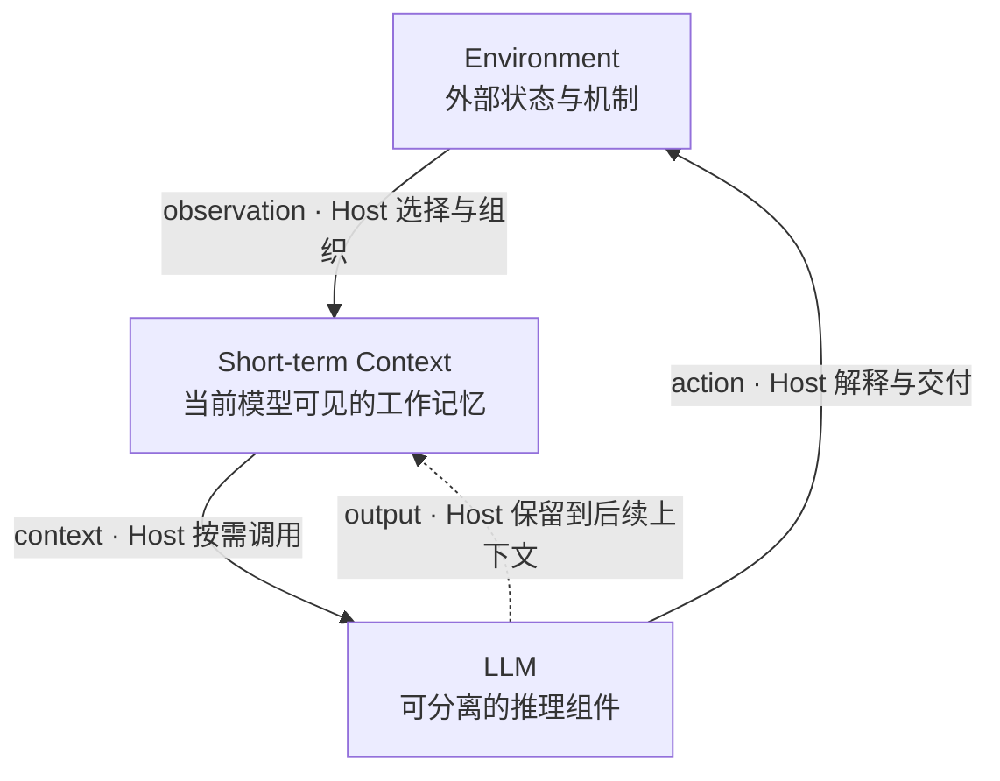
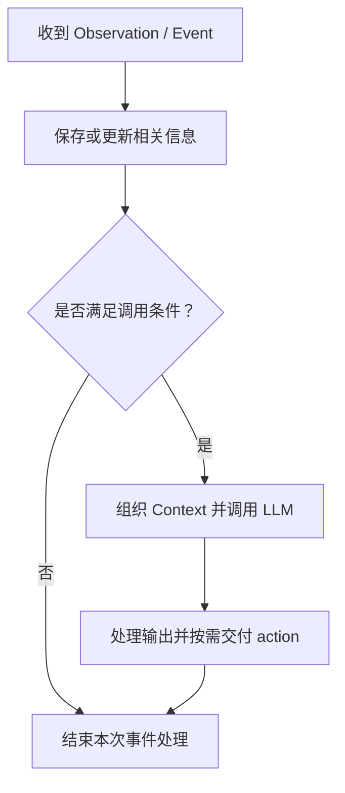
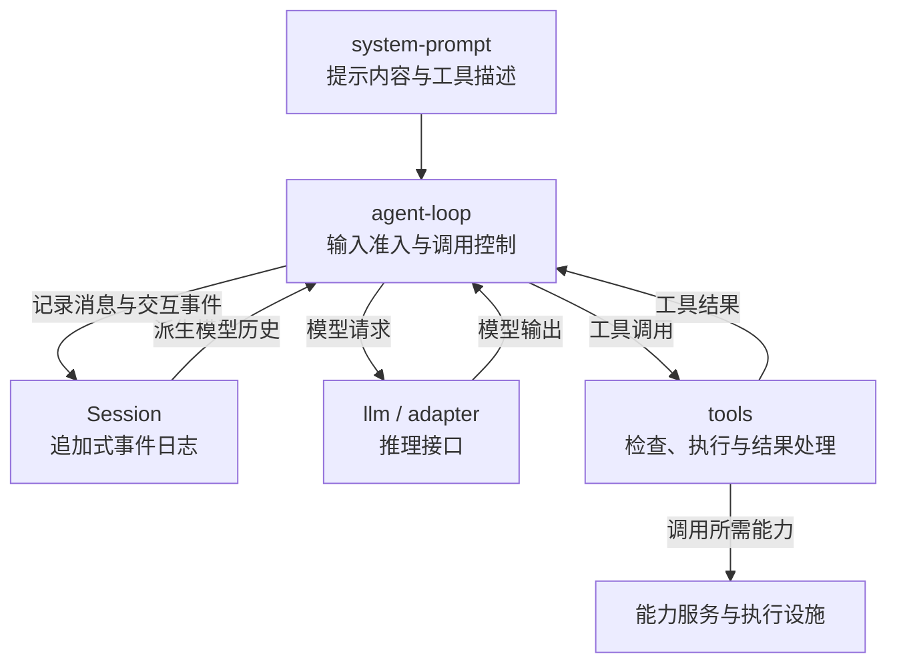

# SemShell：从 Agent 的决策边界到统一执行模型

## 1. LLM Agent 的最小模型

### 1.1 Agent 作为决策与协调角色

本文从强化学习与控制系统中的观测—行动关系出发，将 **Agent 定义为根据可见信息作出决策、选择行动或协调工作的角色**。其基本关系是：

```text
observation → Agent → action
```

这一角色不限定实现方式：它可以由 LLM 参与实现，也可以采用其他决策机制；工具、记忆服务、显式循环、独立进程和特定框架都不是定义的前提。本文关注 LLM Agent，但始终区分角色与工程对象。框架中的 `Agent` class 是实现这一角色的一种容器，具体封装哪些组件取决于软件设计，不能直接将它与 Agent 角色、LLM 或 Runtime 等同。

### 1.2 LLM 作为可分离的推理组件

LLM 是实现 Agent 决策功能的一种计算组件，其接口可以抽象为：

```text
Context → LLM Inference → Output
```

模型根据当前上下文生成回答、判断、计划或行动请求。推理具有明确的输入与输出边界，因此可以在逻辑上与上下文管理、环境交互和执行管理分离。它既可以通过远程 API 或本地推理服务提供，也可以嵌入应用或由分布式设施承载；逻辑上的可分离性不要求物理隔离。

单次推理不以模型知道“自己属于一个 Agent”为前提。上下文可以说明它正在承担的角色，但不会因此赋予模型 Agent 的生命周期。本文将一次模型调用视为离散的推理过程，其中可以生成多步计划；任务如何跨调用延续、何时再次调用模型，以及已提交的行动如何继续执行，都由模型之外的机制维护。

### 1.3 短期上下文作为工作记忆

**Short-term Context 是当前推理中模型能够直接使用的动态信息集合**，包括环境观测、近期历史、先前模型输出、指令、工作记录、工具描述和检索材料，也可以包含图像等多模态信息。本文将其称为短期记忆或工作记忆。“短期”指信息参与本次推理的方式，与原始材料在外部保存了多久无关。

跨调用的认知连续性依赖相关信息被再次提供。出现在前一次调用中的内容，不保证后一次调用仍然可见。上下文管理通过保留原文、提取片段或生成摘要，使后续推理能够接续目标、证据与未完成事项；不同组织方式也会保留不同程度的细节。

上下文包含对环境观测的选择性表示，以及指令、历史输出等推理材料，**不等于完整环境状态、完整事件日志或运行事实本身**。例如，测试已经结束，而完成通知尚未进入上下文时，“测试运行中”只是较早的观测。任务是否仍在运行，需要依据执行系统的状态与记录确认。

### 1.4 参数记忆与外部存储

本文用**参数化长期记忆**指模型参数中编码的知识与能力，例如语言模式、领域知识和代码生成能力。这个术语用于区分模型通过训练形成的能力与工程系统保存的记录，并不保证其中的知识正确或能被精确回忆。在参数固定的推理过程中，加入新上下文不会直接更新模型参数；训练和微调属于另一条更新路径。

数据库、向量存储、文件、对话归档和用户资料，统一视为外部状态或外部存储。工程系统可以把用于跨会话复用的记录称为“长期记忆”，但它们仍不是 LLM 的参数记忆。相关内容只有被读取并提供给模型后，才成为当前推理可直接使用的信息。

| 信息形态 | 信息载体 | 参与本次推理的方式 |
| --- | --- | --- |
| 短期上下文／工作记忆 | 本次调用提供给模型的输入 | 作为当前可见的信息参与推理 |
| 参数化长期记忆 | 模型参数 | 通过已训练的参数参与输入处理与输出生成 |
| 外部存储 | 文件、数据库、向量存储等 | 相关内容经读取与组织后进入上下文 |

同一份内容可以同时存在于外部存储和当前上下文中。例如，一条几个月前保存的项目约定，在磁盘上是持久记录，被提供给模型后又成为当前上下文。裁剪上下文不会因此删除外部记录，保存完整日志也不意味着模型已经看过全部内容。

### 1.5 Agent Host：角色的工程实现

本文将**实现 Agent 角色的宿主程序称为 Agent Host**。对于 LLM Agent，它负责上下文管理、LLM 调用、输出解释与环境交互：接收信息、组织输入、决定何时调用模型，再将输出保留为后续推理材料或交给环境处理。Agent 表达决策与协调角色，Agent Host 则将这一角色落实为软件行为。

Agent Host 可以是一个进程、服务、框架对象或事件处理器，也可以由分布式组件共同实现。这里的 Host 表示角色的宿主实现，不意味着它拥有运行时管理权限，也不等同于 SemShell 的 Host 管理侧。

在记录能够完整放入模型输入的最简实现中，上下文管理只需维护一份追加日志。用户输入和环境反馈写入日志后，管理器按模型输入格式组织这些记录并调用 LLM；模型输出的指令、显式分析或工作记录等内容，以副本形式保留到日志中，工具调用请求则交给 Environment。此时，当前日志就构成工作上下文，无须额外的检索、摘要或复杂调度。

复杂一些的实现可以加入调用条件：信息到达后先被保存，条件满足时才调用 LLM。例如，模型可以提前提出“等待两项测试都完成后再分析”，由 Host 转换为可检查的规则；条件也可以由 Environment 提供或检查，并在满足时通知 Host。已明确的条件可以由普通程序检查，无须为每条反馈重新进行模型推理。

这里的上下文管理器因此兼有信息管理与调用控制两类职责，属于 Agent Host 的一部分。它决定模型何时获得哪些信息；环境中的执行组件则负责请求如何被接受、运行和结束。即使这些职责由同一段程序实现，也需要明确各自维护的状态。

### 1.6 Environment：相对当前 Agent 的外部状态与机制

从当前 Agent 的局部视角看，**Environment 是决策角色之外、它能够观察或作用的外部状态与机制**。工具、shell、文件系统、网络、用户、服务、runtime、其他 Agent 和外部存储，都可以属于 Environment。这个边界按交互与职责划分，同一个应用可以同时实现 Agent Host 和部分环境能力。

工具和 Subagent 在本章中被视为环境中的不同软件角色：工具处理操作，Subagent 实现另一个决策角色。它们与远程服务、用户一样，都可以通过 action 与 observation 和当前 Agent 交互；共同的交互关系不意味着相同的权限、能力或生命周期。

Environment 内部仍可分为多个组件与管理层次。例如，外部存储保存记录，runtime 维护任务与资源，另一个 Agent 处理特定问题。它们在当前 Agent 的交互视角下同属环境，各自仍可独立实现。

### 1.7 Action 与 Observation

**Action 是 Agent 面向 Environment 发出的行为请求**，包括回复用户、读取文件、运行程序或委派任务等。Agent Host 解释模型输出并交付请求，环境组件再决定是否接受以及如何处理。请求可以引起环境状态变化，但提出请求不等于执行成功。

行动交付与上下文更新是两条逻辑通道：

```text
行动通道：模型输出 → Host 解释与交付 → Environment 处理
记忆通道：输入、输出与观测 → 保存／选择／组织 → 后续 Context
```

同一份输出可以进入两条通道，但行动并不以写入上下文为生效条件。将“准备运行测试”写进日志，不代表测试已经启动；请求提出、执行启动和测试完成，是三个不同的事实。反过来，请求已经执行而结果交付中断时，缺少返回内容也不能证明行动没有发生。

**Observation 是 Environment 向当前 Agent 提供的可见反馈**，例如用户的新要求、工具结果或任务状态变化。它只揭示环境的一部分，Agent Host 还可以进一步选择、过滤或加工，再将其用于后续上下文。例如，完整测试日志保存在环境中，模型只收到失败用例与关键报错。摘要应保留当前判断需要的请求归属、执行状态和待确认事项，不能把“已提交”压缩成“已完成”。

两条通道可以共用数据与设施。写入任务笔记在执行层是文件写入行动，在后续使用中又参与记忆管理；写入是否成功、内容是否进入后续上下文，仍需分别判断。

### 1.8 最小交互模型

将上述关系合在一起，可以得到最小 LLM Agent 交互模型：

**Figure 1 — Minimal LLM-Agent Interaction Model**



Agent 角色对应根据可见信息形成行动的整体决策关系。LLM 提供推理能力，Context 提供本次可见的动态信息，Environment 提供观测并接受行动请求。Agent Host 实现箭头所示的信息组织、调用与交付；图中按职责展示关系，不规定组件的部署位置。

虚线表示模型输出可以被保留到后续上下文，是否保留以及保留哪些内容由 Host 决定。指向 Environment 的行动路径同样经过 Host 处理，不表示模型直接执行请求。这些路径可以随时间重复发生，下一次调用由什么触发，则取决于具体实现。

### 1.9 Loop 的含义：随时间重复的交互

这里的 loop 描述一种可以重复发生的交互时序：

```text
Context_t → LLM → action → Environment → observation → Context_{t+1}
```

这条路径不要求每次推理都产生工具请求，也不要求每条观测都立即触发推理。模型输出还可以直接参与后续上下文更新。**Loop 是交互随时间重复形成的结构，不是 Agent 定义中必须拥有的额外组件。**

Agent Host 可以用显式的 `while` 循环实现，也可以由事件驱动：



下一次事件到来后，Host 再处理信息；一次模型调用也可以使用此前积累的多条观测。调用是按需激活推理的方式，结束后不必立即开始下一轮。因此，系统可以表现出循环交互，而不要求 Agent 显式拥有一个循环。

**决策连续性与执行连续性**也由此分开：前者依靠多次推理之间的信息衔接，后者依靠执行系统维护任务与资源。模型暂时没有新调用时，测试程序仍可继续运行；等待结果、跟踪进度和传播取消，都可以按既定规则处理。同步与异步接口均可保持这种职责划分。

模型调用结束不代表外部任务结束。任务所有者退出、取消或执行设施失效后，工作能否继续，由具体生命周期规则决定；跨越多次推理运行，也不自动意味着能跨服务重启恢复。

这些区分为后文提供了共同的术语基础。第二章将进一步讨论工程系统如何组合这些职责、Agent Host 为什么会扩展到执行管理，以及哪些运行状态应由独立的管理主体维护。

## 2. 从 Agent Host 到执行管理：DeepSeek Harness 的对照

### 2.1 从职责划分看工程实现

第一章给出了 Agent 的最小模型：决策角色由 Agent Host 实现，LLM 提供推理能力，环境负责处理行动并返回观测。工程系统还要把这些职责落实为具体组件，并处理排队、等待、取消、权限与结果交付。一个 harness 因而往往同时包含 Agent Host 及其配套的执行设施。

本章以 DeepSeek Harness 为主要参照，依据公开文档与源码分析这些职责如何组合，再与 SemShell 的执行模型对照。核对日期为 2026-09-20，文档与源码固定到提交 `ddefc45`；项目当时仍标为 developer preview。下文区分该版本的接口与实现、本文据此作出的架构判断；比较限于静态分析，不包含运行或性能测试。产品中的 `Agent` 对象仍按其工程含义理解。[项目说明](https://github.com/deepseek-ai/deepseek-harness/blob/ddefc45fbc7f8e46dd73185e68295696d1297887/README.md)

### 2.2 Cordis：用插件组织能力与依赖

DeepSeek Harness 以 Cordis 为组合基础。模型适配器、工具注册表、会话日志以及默认 agent loop 都由插件提供，通过服务接口与事件协作。启动配置决定装配哪些能力，插件注册的工具、监听器和其他资源随其卸载而撤销。这里的可替换性覆盖了驱动模型交互的逻辑本身，而不只覆盖外围工具。[架构说明](https://github.com/deepseek-ai/deepseek-harness/blob/ddefc45fbc7f8e46dd73185e68295696d1297887/docs/architecture.md)

Cordis 的 `Context` 是插件查找服务、注册能力和管理作用域的工程对象，例如 `ctx.llm`、`ctx.tools` 与 `ctx.sessions`。它与第一章的 Short-term Context 含义不同：前者组织软件能力，后者表示当前模型可见的信息。服务可以参与生成模型输入，但服务对象本身不会因此成为模型上下文。[Cordis 基本概念](https://github.com/deepseek-ai/deepseek-harness/blob/ddefc45fbc7f8e46dd73185e68295696d1297887/docs/cordis-primer.md)

按第一章的术语，Harness 中的组件可以映射到以下职责：

| 第一章的职责 | Harness 中的主要对应组件 | 负责的内容 |
| --- | --- | --- |
| 保存交互记录、提供历史材料 | `session` | 记录事件，并派生模型消息历史 |
| 组织本次输入 | `system-prompt` 与相关扩展 | 拼装提示内容和工具描述 |
| 控制调用、处理输出 | `agent-loop` | 驱动 step / turn，协调模型请求与工具调用 |
| 提供推理能力 | `llm` 及模型适配器 | 定义模型请求、消息和流式输出接口 |
| 执行行动请求 | `tools` 及能力服务 | 查找工具、检查请求、执行并返回结果 |

这张表是本文对职责的映射，不表示五个独立进程或固定部署层次。Harness 将公开的 `Agent` 接口与默认 `agent-loop` 实现分开，扩展面向接口编写，使驱动逻辑可以替换。因此，Agent Host 可以由插件组合实现，不必对应一个包揽全部职责的对象。[核心组件与 Agent 接口](https://github.com/deepseek-ai/deepseek-harness/blob/ddefc45fbc7f8e46dd73185e68295696d1297887/docs/subsystems/core.md)

### 2.3 会话日志、上下文投影与按需唤醒

Harness 的 `Session` 是追加式事件日志，模型消息历史通过 `deriveMessages()` 从中派生。日志既包含形成模型消息的内容，也包含边界、尝试和运行记录等不直接进入消息历史的事件；上下文替换和压缩也通过日志及投影规则表达。由此，完整交互记录与当前模型可见历史具有不同的范围。[Session 与消息投影](https://github.com/deepseek-ai/deepseek-harness/blob/ddefc45fbc7f8e46dd73185e68295696d1297887/docs/subsystems/session.md)

这与第一章的区分相符：日志可以支撑追踪、重建和恢复，模型只使用本次请求选定的表示。即使某条记录仍在 Session 中，也不能仅凭“已经记录”就判断它仍对模型可见。这里的 Session 是交互历史的事实来源，其范围也不等于整个 Environment 的全部状态。

信息交付与唤醒同样被分开。公开接口中的 `inject()` 把内容放到下一步的输入队列，但不唤醒空闲驱动；`followup()` 排入下一轮并请求唤醒；`steer()` 把内容送往最近的 step 边界，并允许唤醒。实现中的 `send(message, target, wakeup)` 明确分开了输入位置和唤醒选择。[输入与唤醒实现](https://github.com/deepseek-ai/deepseek-harness/blob/ddefc45fbc7f8e46dd73185e68295696d1297887/packages/core/agent-loop/src/agent.ts#L128-L146)

唤醒驱动也不保证一定发出模型请求。默认流程在调用前经过 `agent/pre-step`，允许扩展改写或拒绝待处理输入；一次 turn 可以因此不包含任何 step。这里的 step 围绕一次模型请求及其工具调用组织，turn 则可以包含多个 step。[Turn 与 Step 流程](https://github.com/deepseek-ai/deepseek-harness/blob/ddefc45fbc7f8e46dd73185e68295696d1297887/docs/agent-lifecycle.md)

因此，Harness 已经为“先积累信息，再按条件调用模型”提供了明确的工程接口。插件可以利用这些接口实现调用策略；默认实现采用 loop，并不意味着每条事件都必须触发一次 LLM 推理。

### 2.4 从模型输出到工具执行

模型生成工具调用后，Harness 通过工具注册表和执行管线处理请求。调用先经过 `tools/pre-execute` 等检查，再进入实际执行，结果还可以经过后处理后交付。审批、不可被后续放宽的拒绝检查、超时和结果处理都有各自的接入位置。模型知道工具描述，与工具请求获得执行许可，是不同阶段。[工具执行管线](https://github.com/deepseek-ai/deepseek-harness/blob/ddefc45fbc7f8e46dd73185e68295696d1297887/docs/tool-execution-pipeline.md)

下图概括默认路径与第一章模型的对应关系。它省略了流式输出、重试和具体策略，表示职责协作，不是完整时序或部署图。

**Figure 2 — DeepSeek Harness 的主要交互路径**



Code mode 进一步允许模型生成程序来组织多步工具操作。其 PTC runtime 接收程序与可调用的宿主绑定，管理本次代码执行的结果、失败、取消和适用的沙箱信息。模型提出程序后，确定的控制流可以由程序继续推进，无须每一步都重新交给模型判断。[PTC 执行接口](https://github.com/deepseek-ai/deepseek-harness/blob/ddefc45fbc7f8e46dd73185e68295696d1297887/docs/subsystems/ptc-runtime.md)

Code mode 中的子调用仍接入工具执行管线，沿用相应的检查与结果处理。按本文模型分析，这条路径把部分协调逻辑交给普通程序执行，同时保留模型决策、工具准入和实际执行之间的分工。[Code mode 子调用路径](https://github.com/deepseek-ai/deepseek-harness/blob/ddefc45fbc7f8e46dd73185e68295696d1297887/docs/tool-execution-pipeline.md)

### 2.5 后台 Job：独立于模型推理的运行状态

Harness 还提供通用后台 Job 服务。生产者负责实际执行资源，Job runtime 维护身份、访问控制和生命周期状态，并提供读取、等待与停止等操作。其种类可扩展，已有类型包括 shell 工作与 Subagent 工作。任务状态由程序维护，不依赖 LLM 在上下文中持续记住“任务正在运行”。[后台 Job 机制](https://github.com/deepseek-ai/deepseek-harness/blob/ddefc45fbc7f8e46dd73185e68295696d1297887/docs/subsystems/jobs.md)

`JobStart` 可以带有 `owner: Agent`：访问按所有者的 Session 身份约束，所有者被释放时会取消并等待关联工作。所有者也可以省略，此时形成无所有者 Job，按该接口规则向调用者开放。可见，Job 已经在不同工作类型之间提供了一层共同管理，同时保留了与 Agent 所有权的集成。[Job 类型与所有权契约](https://github.com/deepseek-ai/deepseek-harness/blob/ddefc45fbc7f8e46dd73185e68295696d1297887/packages/jobs/jobs/src/types.ts)

完成也有明确含义。`JobHooks.done` 约定在生产者释放资源后完成；它不只表示计算得到了结果。发出停止请求、记录进入停止状态，以及底层工作实际结束，需要分别处理。普通程序可以在这些阶段继续等待、收集输出并更新状态，模型只在需要解释结果或作出新判断时参与。

以第一章的测试任务为例，模型提出执行请求后，测试可以作为后台工作运行。Job 服务维护其进度与终态，后续再通过相应工具或通知机制提供可见结果。这已经实现了决策时段与执行时段的分离，也说明分析 Harness 时需要把它已有的运行时机制纳入比较。

### 2.6 Subagent：委派能力与独立的生命周期管理

Subagent 在 Harness 中是一项可选能力，通过 `ctx.subagents` 接口连接不同 provider，不是默认 agent loop 必须内置的一种子对象。provider 可以采用不同的创建或委派方式，服务在启动前检查请求的能力是否受支持。对父 Agent 而言，委派通过工具和服务接口发生；被委派者内部如何实现，可以由 provider 决定。[Subagent 接口与 provider](https://github.com/deepseek-ai/deepseek-harness/blob/ddefc45fbc7f8e46dd73185e68295696d1297887/docs/subsystems/subagent.md)

该版本还区分一次性委派与可继续交互的子会话。后者保留一个持久的 child Session，并在需要运行时创建进程内的 Activation。一次 Activation 可以承接多轮输入，并不等于一次模型请求或一个带结果的 Job。continuation manager 负责其准入、父子关系、冷恢复和子级优先的释放；子 Agent 的 turn 顺序仍由驱动实现管理。

这一设计使会话历史与当前驻留的执行状态分开，也给取消规定了不同范围：可继续子会话接受输入后，其 Activation 由管理器接管，调用者随后取消不会自动撤销已接受的工作；中断当前 turn 与释放整个 Activation 也是不同操作。这些语义由程序明确维护。[可继续子会话与 Activation](https://github.com/deepseek-ai/deepseek-harness/blob/ddefc45fbc7f8e46dd73185e68295696d1297887/docs/subsystems/subagent.md#continuable-children-and-activations)

因此，Harness 中已经存在多层运行管理：插件管理软件能力的装配，Agent 驱动管理会话活动，Job 管理后台工作，continuation manager 管理可继续子会话。它们解决不同问题；进一步的比较应当考察这些对象的关系与边界。

### 2.7 与 SemShell 对照：共同机制如何组织

下面的比较以本章核对的 Harness 机制与 SemShell 当前的参考设计为范围。SemShell 将需要独立运行的软件表示为逻辑 Process，以共同的 Event / Action 接口组织身份、所有权、等待、取消和结果；简单资源访问仍可通过受控 bridge 提供，不要求每个函数都成为 Process。[SemShell 设计](./docs/design.md)、[执行语义](./docs/semantics.md)

| 比较维度 | DeepSeek Harness | SemShell 的设计选择 |
| --- | --- | --- |
| 能力如何组合 | 插件通过服务接口、事件与作用域组合 | 独立程序通过统一执行接口组合，资源能力通过明确接口接入 |
| 运行活动如何表达 | Agent 驱动会话活动，Job、Subagent Activation、PTC run 表达相应运行活动；Session 保存历史 | 独立运行实例统一表示为 Process，内部可采用不同实现 |
| 身份与生命周期 | 各执行机制有明确契约，例如 Job 所有权和子会话 Activation 管理 | 将 Process 身份、所有权、等待、取消与终态放入共同执行语义 |
| 权限如何落实 | 工具管线、所有者访问控制和执行后端承担相应检查 | 以 Principal / Authority 表达授权来源与执行主体权限，在执行边界检查 |
| 决策实现如何替换 | 模型适配器、驱动和能力 provider 可以替换 | LLM 程序、规则程序和面向人的程序使用同一执行契约 |

两者已有明显的共同点：都将实际执行放在模型之外，都允许按需使用推理，也都需要显式管理状态与资源。Harness 的 Job 尤其说明，跨工作类型的管理抽象已经存在。SemShell 要进一步探索的是：能否把这种共同语义扩展为独立程序的基础，使协调器、LLM 程序与普通工具在运行时采用同一种执行主体。

这个差异不意味着插件与 Process 只能二选一。插件机制可以负责安装和提供某类程序，执行系统再负责该程序的一次运行。两者也不完全互不相关：卸载能力可能要求清理依赖它的运行实例，但插件注册的生命周期与某次任务的完成条件仍需分别定义。

统一执行对象也有代价。它需要为原本各自清晰的会话、后台任务和委派机制设计共同契约，同时容纳它们不同的交互方式。SemShell 当前是用于验证这些语义的参考实现，不能仅凭抽象更统一，就推断其功能、性能或生产可靠性优于 Harness。

### 2.8 引出共同执行语义

DeepSeek Harness 展示了如何通过可替换组件实现 Agent Host，并逐步提供后台执行、委派和生命周期管理。沿着这个实例，本文可以把问题进一步收敛：当一项工作需要身份、权限、所有权、等待、取消与结果时，这些语义能否由共同的执行层提供，而不必每次围绕特定角色重新组织？

第三章将从这一问题出发，讨论如何保留 Agent 的决策与协调职责，同时为承担不同角色的程序建立统一的执行边界。

## 3. 将决策与执行管理分离

### 3.1 保留 Agent 的决策与协调角色

Agent 继续表达基本的决策关系：

```text
observation → decision → action
```

实现这一角色的 Agent Host 仍可采用 ReAct、规划或其他推理策略。上下文管理与 LLM 调用继续支持决策，外部能力则通过明确的接口提供。

Agent Host 可以调用协调程序，也可以被协调程序调用。确定性程序可以把某一步语义判断交给 LLM，LLM-backed program 也可以将一组已确定的工作交给普通程序推进。系统的执行结构不必预设某个 Agent Host 永远位于最上层。

### 3.2 区分认知状态与运行状态

短期上下文承担模型本次推理所需的认知状态，执行层维护运行中的事实与关系：

| 认知状态（Cognitive state） | 运行状态（Operational state） |
| --- | --- |
| 近期观测与相关历史 | 运行实例及其生命周期 |
| 指令、Skill 与工作材料 | 有效权限与资源访问规则 |
| 任务状态的模型可见表示 | 所有权、等待与取消关系 |
| 支持下一步判断的结果摘要 | 已提交的完成状态与结果 |

LLM 可以观察、推理和使用右侧的状态，但上下文不应成为它们的唯一事实来源。上下文被裁剪，或一次模型调用结束，都不应改变任务是否仍在运行、具有什么权限以及是否已经完成。

### 3.3 为独立组件提供统一执行语义

不同程序内部行为可以完全不同：有的调用 LLM，有的执行确定性计算，有的协调其他程序，有的提供面向人的交互。但当它们进入运行状态时，都可能需要身份、输入输出、生命周期、权限、取消和结果等管理语义。

统一执行层为这些关系提供共同的表达方式。它统一的是程序如何被识别、启动、约束和结束；程序的功能及决策方式仍由各自实现。

权限也可在这一层统一组织。系统通过白名单、权限分级或显式授权集合等策略，判断某个执行主体能否对目标资源实施指定操作。Agent 可以提出请求，实际授予的权限由系统维护；LLM、规则程序和面向人的程序使用同一套检查原则。

描述一项能力、发现一项能力和获准执行它，应当有各自明确的含义。这使权限管理成为共同的系统机制，而不依赖模型是否记住了完整的权限说明。

### 3.4 用 Event / Action 表达执行边界

独立程序与 runtime 可以通过统一接口交互：

```text
Event → 程序处理 → Action
```

Event 表达输入或状态变化，Action 表达程序请求的下一步操作，包括启动、等待、发送、调用资源、取消、退出和失败等。Tool calling 可以作为其中一种交互形式，而不必决定整个 runtime 的组织方式。

程序处理一次事件不必调用一次 LLM。普通逻辑可以处理确定的状态转换；需要推理时，程序再组织上下文并调用模型。runtime 事件与模型可见观测之间仍有选择与转换的过程。

提交请求后，执行可以独立推进。等待期间无需持续激活模型，结果可以保存或排队，再交给程序处理。具体的创建、等待和完成顺序由执行协议规定，后文再用案例展开。

### 3.5 Runtime 仍属于 Environment

上述划分保持了 Figure 1 的局部模型：Agent 发出 action，Environment 处理请求，并提供后续 observation。runtime 本身就是环境的一部分。

runtime 根据既定规则进行准入、调度、跟踪、授权、取消与结果报告。协调程序可以管理分发、规则化重试和结果收集；需要语义判断或目标调整时，再调用合适的 Agent。

因此，policy 与 mechanism 的划分要落实到具体步骤。例如，按既定次数重试和失败后重新选择方法可以由不同组件承担，收集结果与解释结果之间的冲突也可以分开。环境中既有管理机制，也可以有承担决策的其他程序，无须将所有协调策略放入 Kernel。

### 3.6 为什么选择 Process-like 模型

当这些共同的执行需求被明确后，Process 就成为一个自然的候选抽象。传统系统已用它表达一次运行的身份、生命周期、权限边界与完成状态；本文借用这些结构性质，为独立程序提供统一的管理对象。

逻辑 Process 可以与具体后端解耦，不必等同于一个 Linux PID。不同运行实例可以具有不同权限和所有者，同时使用相同的执行接口。执行实体的类型平等，与任务中的父子关系并不冲突。

这一模型的价值在于状态明确、生命周期清晰、权限关系可解释，以及组合结构容易检查。它不预先保证更快或更经济，也不是组件独立性的唯一实现方式。

### 3.7 引出 SemShell

由此可以提出一个具体实验问题：如果将 LLM-backed software、普通程序、协调器和 Operator 放入同一个 process-like runtime，并让它们共享统一的 execution semantics，会形成怎样的软件结构？

这里的 Operator 是程序承担的决策与协调角色。它可以由 LLM-backed program、规则程序或面向人的程序实现；改变这一角色的实现，不应要求下游程序同时改变执行模型。

SemShell 在后续章节作为这一问题的 executable reference design 出场。接下来需要通过具体模型与案例检验：身份、权限、所有权和生命周期能否在 LLM 之外得到一致管理，不同决策方式又能否在同一执行结构中替换。
