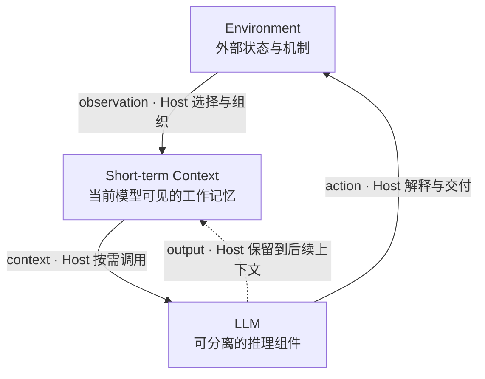
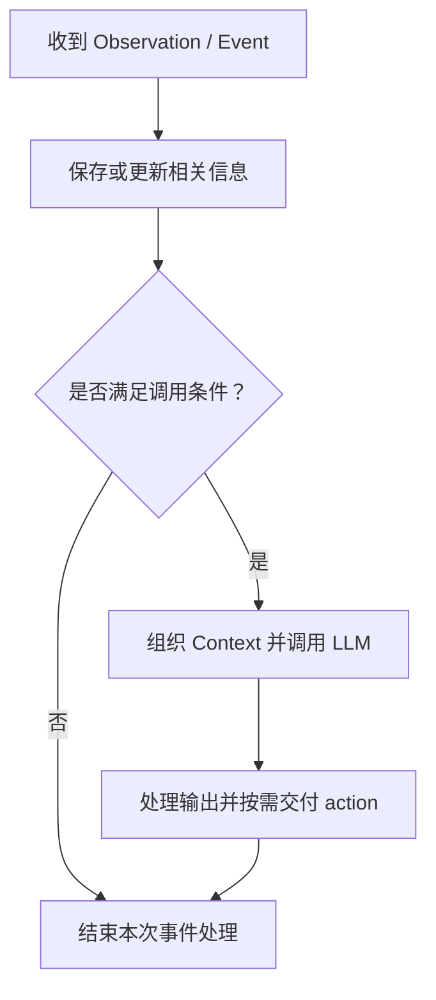

# SemShell：从 Agent 的决策边界到统一执行模型

## 1. LLM Agent 的最小模型

### 1.1 Agent 作为决策与协调角色

本文从强化学习与控制系统中的观测—行动关系出发，将 **Agent 定义为根据可见信息作出决策、选择行动或协调工作的角色**。其基本关系是：

```text
observation → Agent → action
```

这一角色不限定实现方式：它可以由 LLM 参与实现，也可以采用其他决策机制；工具、记忆服务、显式循环、独立进程和特定框架都不是定义的前提。本文关注 LLM Agent，但始终区分角色与工程对象。框架中的 `Agent` class 是实现这一角色的一种容器，具体封装哪些组件取决于软件设计，不能直接将它与 Agent 角色、LLM 或 Runtime 等同。

### 1.2 LLM 作为可分离的推理组件

LLM 是实现 Agent 决策功能的一种计算组件，其接口可以抽象为：

```text
Context → LLM Inference → Output
```

模型根据当前上下文生成回答、判断、计划或行动请求。推理具有明确的输入与输出边界，因此可以在逻辑上与上下文管理、环境交互和执行管理分离。它既可以通过远程 API 或本地推理服务提供，也可以嵌入应用或由分布式设施承载；逻辑上的可分离性不要求物理隔离。

单次推理不以模型知道“自己属于一个 Agent”为前提。上下文可以说明它正在承担的角色，但不会因此赋予模型 Agent 的生命周期。本文将一次模型调用视为离散的推理过程，其中可以生成多步计划；任务如何跨调用延续、何时再次调用模型，以及已提交的行动如何继续执行，都由模型之外的机制维护。

### 1.3 短期上下文作为工作记忆

**Short-term Context 是当前推理中模型能够直接使用的动态信息集合**，包括环境观测、近期历史、先前模型输出、指令、工作记录、工具描述和检索材料，也可以包含图像等多模态信息。本文将其称为短期记忆或工作记忆。“短期”指信息参与本次推理的方式，与原始材料在外部保存了多久无关。

跨调用的认知连续性依赖相关信息被再次提供。出现在前一次调用中的内容，不保证后一次调用仍然可见。上下文管理通过保留原文、提取片段或生成摘要，使后续推理能够接续目标、证据与未完成事项；不同组织方式也会保留不同程度的细节。

上下文包含对环境观测的选择性表示，以及指令、历史输出等推理材料，**不等于完整环境状态、完整事件日志或运行事实本身**。例如，测试已经结束，而完成通知尚未进入上下文时，“测试运行中”只是较早的观测。任务是否仍在运行，需要依据执行系统的状态与记录确认。

### 1.4 参数记忆与外部存储

本文用**参数化长期记忆**指模型参数中编码的知识与能力，例如语言模式、领域知识和代码生成能力。这个术语用于区分模型通过训练形成的能力与工程系统保存的记录，并不保证其中的知识正确或能被精确回忆。在参数固定的推理过程中，加入新上下文不会直接更新模型参数；训练和微调属于另一条更新路径。

数据库、向量存储、文件、对话归档和用户资料，统一视为外部状态或外部存储。工程系统可以把用于跨会话复用的记录称为“长期记忆”，但它们仍不是 LLM 的参数记忆。相关内容只有被读取并提供给模型后，才成为当前推理可直接使用的信息。

| 信息形态 | 信息载体 | 参与本次推理的方式 |
| --- | --- | --- |
| 短期上下文／工作记忆 | 本次调用提供给模型的输入 | 作为当前可见的信息参与推理 |
| 参数化长期记忆 | 模型参数 | 通过已训练的参数参与输入处理与输出生成 |
| 外部存储 | 文件、数据库、向量存储等 | 相关内容经读取与组织后进入上下文 |

同一份内容可以同时存在于外部存储和当前上下文中。例如，一条几个月前保存的项目约定，在磁盘上是持久记录，被提供给模型后又成为当前上下文。裁剪上下文不会因此删除外部记录，保存完整日志也不意味着模型已经看过全部内容。

### 1.5 Agent Host：角色的工程实现

本文将**实现 Agent 角色的宿主程序称为 Agent Host**。对于 LLM Agent，它负责上下文管理、LLM 调用、输出解释与环境交互：接收信息、组织输入、决定何时调用模型，再将输出保留为后续推理材料或交给环境处理。Agent 表达决策与协调角色，Agent Host 则将这一角色落实为软件行为。

Agent Host 可以是一个进程、服务、框架对象或事件处理器，也可以由分布式组件共同实现。这里的 Host 表示角色的宿主实现，不意味着它拥有运行时管理权限，也不等同于 SemShell 的 Host 管理侧。

在记录能够完整放入模型输入的最简实现中，上下文管理只需维护一份追加日志。用户输入和环境反馈写入日志后，管理器按模型输入格式组织这些记录并调用 LLM；模型输出的指令、显式分析或工作记录等内容，以副本形式保留到日志中，工具调用请求则交给 Environment。此时，当前日志就构成工作上下文，无须额外的检索、摘要或复杂调度。

复杂一些的实现可以加入调用条件：信息到达后先被保存，条件满足时才调用 LLM。例如，模型可以提前提出“等待两项测试都完成后再分析”，由 Host 转换为可检查的规则；条件也可以由 Environment 提供或检查，并在满足时通知 Host。已明确的条件可以由普通程序检查，无须为每条反馈重新进行模型推理。

这里的上下文管理器因此兼有信息管理与调用控制两类职责，属于 Agent Host 的一部分。它决定模型何时获得哪些信息；环境中的执行组件则负责请求如何被接受、运行和结束。即使这些职责由同一段程序实现，也需要明确各自维护的状态。

### 1.6 Environment：相对当前 Agent 的外部状态与机制

从当前 Agent 的局部视角看，**Environment 是决策角色之外、它能够观察或作用的外部状态与机制**。工具、shell、文件系统、网络、用户、服务、runtime、其他 Agent 和外部存储，都可以属于 Environment。这个边界按交互与职责划分，同一个应用可以同时实现 Agent Host 和部分环境能力。

工具和 Subagent 在本章中被视为环境中的不同软件角色：工具处理操作，Subagent 实现另一个决策角色。它们与远程服务、用户一样，都可以通过 action 与 observation 和当前 Agent 交互；共同的交互关系不意味着相同的权限、能力或生命周期。

Environment 内部仍可分为多个组件与管理层次。例如，外部存储保存记录，runtime 维护任务与资源，另一个 Agent 处理特定问题。它们在当前 Agent 的交互视角下同属环境，各自仍可独立实现。

### 1.7 Action 与 Observation

**Action 是 Agent 面向 Environment 发出的行为请求**，包括回复用户、读取文件、运行程序或委派任务等。Agent Host 解释模型输出并交付请求，环境组件再决定是否接受以及如何处理。请求可以引起环境状态变化，但提出请求不等于执行成功。

行动交付与上下文更新是两条逻辑通道：

```text
行动通道：模型输出 → Host 解释与交付 → Environment 处理
记忆通道：输入、输出与观测 → 保存／选择／组织 → 后续 Context
```

同一份输出可以进入两条通道，但行动并不以写入上下文为生效条件。将“准备运行测试”写进日志，不代表测试已经启动；请求提出、执行启动和测试完成，是三个不同的事实。反过来，请求已经执行而结果交付中断时，缺少返回内容也不能证明行动没有发生。

**Observation 是 Environment 向当前 Agent 提供的可见反馈**，例如用户的新要求、工具结果或任务状态变化。它只揭示环境的一部分，Agent Host 还可以进一步选择、过滤或加工，再将其用于后续上下文。例如，完整测试日志保存在环境中，模型只收到失败用例与关键报错。摘要应保留当前判断需要的请求归属、执行状态和待确认事项，不能把“已提交”压缩成“已完成”。

两条通道可以共用数据与设施。写入任务笔记在执行层是文件写入行动，在后续使用中又参与记忆管理；写入是否成功、内容是否进入后续上下文，仍需分别判断。

### 1.8 最小交互模型

将上述关系合在一起，可以得到最小 LLM Agent 交互模型：

**Figure 1 — Minimal LLM-Agent Interaction Model**



Agent 角色对应根据可见信息形成行动的整体决策关系。LLM 提供推理能力，Context 提供本次可见的动态信息，Environment 提供观测并接受行动请求。Agent Host 实现箭头所示的信息组织、调用与交付；图中按职责展示关系，不规定组件的部署位置。

虚线表示模型输出可以被保留到后续上下文，是否保留以及保留哪些内容由 Host 决定。指向 Environment 的行动路径同样经过 Host 处理，不表示模型直接执行请求。这些路径可以随时间重复发生，下一次调用由什么触发，则取决于具体实现。

### 1.9 Loop 的含义：随时间重复的交互

这里的 loop 描述一种可以重复发生的交互时序：

```text
Context_t → LLM → action → Environment → observation → Context_{t+1}
```

这条路径不要求每次推理都产生工具请求，也不要求每条观测都立即触发推理。模型输出还可以直接参与后续上下文更新。**Loop 是交互随时间重复形成的结构，不是 Agent 定义中必须拥有的额外组件。**

Agent Host 可以用显式的 `while` 循环实现，也可以由事件驱动：



下一次事件到来后，Host 再处理信息；一次模型调用也可以使用此前积累的多条观测。调用是按需激活推理的方式，结束后不必立即开始下一轮。因此，系统可以表现出循环交互，而不要求 Agent 显式拥有一个循环。

**决策连续性与执行连续性**也由此分开：前者依靠多次推理之间的信息衔接，后者依靠执行系统维护任务与资源。模型暂时没有新调用时，测试程序仍可继续运行；等待结果、跟踪进度和传播取消，都可以按既定规则处理。同步与异步接口均可保持这种职责划分。

模型调用结束不代表外部任务结束。任务所有者退出、取消或执行设施失效后，工作能否继续，由具体生命周期规则决定；跨越多次推理运行，也不自动意味着能跨服务重启恢复。

这些区分为后文提供了共同的术语基础。第二章将进一步讨论工程系统如何组合这些职责、Agent Host 为什么会扩展到执行管理，以及哪些运行状态应由独立的管理主体维护。

## 2. 从决策角色到执行管理问题

### 2.1 Agent Host 为什么会扩展到执行管理

第一章区分了决策角色、模型推理与环境执行。Agent Host 将决策角色落实为软件行为：组织上下文、调用模型、解释输出并交付行动请求。但一个可以持续完成工作的系统，还需要处理请求发出之后的事情。

例如，Agent 请求运行测试后，系统需要知道测试是否已经启动、由谁负责、何时结束以及结果交给谁。多个任务同时运行时，还需要处理等待、失败、重试与取消。涉及资源访问时，又需要确定请求所依据的权限。这些需求伴随工作复杂度增加而出现，并不因采用 LLM 就消失。

把相关机制放在 Agent Host 周围，是一种直接的工程组织方式：这里已经拥有任务入口、调用接口和结果接收路径。随着功能增加，最初支持模型决策的宿主程序，也就可能承担执行跟踪、子任务管理、权限处理和资源清理等运行时职责。一个 harness 因而往往同时包含 Agent Host 及其配套的执行设施。

需要讨论的是这些职责之间的关系。模型调用、上下文更新、外部任务执行与资源管理，可以在同一个应用中实现，但它们各自维护什么状态、依赖谁持续运行，需要有明确的边界。

### 2.2 从认知连续性到执行连续性

上下文管理维持的是多次推理之间的信息衔接：当前目标是什么，已有何种证据，还有哪些问题需要判断。执行管理则需要确认请求是否获准、任务是否仍在运行、谁可以停止它，以及什么条件下可以报告完成。

这些信息可能同时出现在上下文中，但实际状态不能由上下文中的表述决定。Agent 看到“测试运行中”，只是获得了一条观测；测试是否已经结束、结果是否已保存，仍需要执行系统给出依据。

耦合也不只发生在模型记忆中。即使任务状态由普通代码维护，如果只能通过某个 Agent Host 访问，或者必须由它不断发出跟进动作才能推进，执行过程仍可能依附于该宿主。判断边界时，需要区分三种关系：

- 信息关系：状态与结果进入上下文，支持模型判断。
- 调用关系：Agent Host 请求外部组件完成工作。
- 管理关系：系统维护这次工作的身份、权限、所有权与生命周期。

前两种关系并不自动决定第三种关系。Agent 发起工作，可以成为该次执行的所有者；但这种所有权仍需要由系统表达和落实，不能只依靠它记住“这是我的子任务”。同样，一个组件被 Agent 使用，也不意味着该组件只能作为 Agent 的内部设施存在。

### 2.3 现实参照：Harness 已经承担了哪些职责

现有 harness 已经提供了模型之外的执行机制。以本文此前核对的 DeepSeek Harness 提交 `ddefc45` 为例，其模型适配器、工具、会话与默认驱动通过 Cordis 插件组合，驱动逻辑本身也可以替换。Agent Host 因而可以由多个组件共同实现。[架构说明](https://github.com/deepseek-ai/deepseek-harness/blob/ddefc45fbc7f8e46dd73185e68295696d1297887/docs/architecture.md)

在信息侧，Session 保存事件日志，模型消息历史从日志中派生；输入接口还区分内容入队与是否唤醒驱动。这说明记录一条信息、把它提供给模型和触发一次推理，可以分别处理。[Session 与消息投影](https://github.com/deepseek-ai/deepseek-harness/blob/ddefc45fbc7f8e46dd73185e68295696d1297887/docs/subsystems/session.md)、[输入与唤醒实现](https://github.com/deepseek-ai/deepseek-harness/blob/ddefc45fbc7f8e46dd73185e68295696d1297887/packages/core/agent-loop/src/agent.ts#L128-L146)

在执行侧，工具管线负责请求检查与执行，后台 Job 维护工作状态并提供等待、停止等操作，可继续交互的子会话则有相应的生命周期管理。执行管理已有明确的软件主体，不能将它概括为“让 LLM 在上下文中记住所有任务”。[工具执行管线](https://github.com/deepseek-ai/deepseek-harness/blob/ddefc45fbc7f8e46dd73185e68295696d1297887/docs/tool-execution-pipeline.md)、[后台 Job](https://github.com/deepseek-ai/deepseek-harness/blob/ddefc45fbc7f8e46dd73185e68295696d1297887/docs/subsystems/jobs.md)、[子会话管理](https://github.com/deepseek-ai/deepseek-harness/blob/ddefc45fbc7f8e46dd73185e68295696d1297887/docs/subsystems/subagent.md)

这个实例把问题推进了一步：模型之外已有多种管理机制，它们分别服务于会话、工具、后台工作与委派。当这些活动需要协作时，彼此的身份、权限、等待和取消规则如何衔接？哪些差异来自工作本身，哪些差异来自各自的接口与组织方式？这里关注的是执行契约如何组合，而不是由模块数量或命名判断设计优劣。

### 2.4 多种执行活动组合时，需要回答什么

考虑一个简单场景：协调程序同时启动测试程序和一个 LLM 分析程序，等两者完成后生成报告。模型可以参与任务安排或结果解释，但两项工作的执行仍需要回答一组共同问题：

| 管理问题 | 场景中需要明确的含义 |
| --- | --- |
| 身份 | 如何区分两次运行，并将输出归到正确的任务？ |
| 权限 | 每项工作以谁的授权运行，可以访问哪些资源？ |
| 所有权 | 谁负责这两项工作，协调程序结束后由谁清理？ |
| 等待 | 等待的是某次调用返回、某条消息，还是整项工作结束？ |
| 取消 | 取消协调程序是否传播到两项工作，怎样确认处理完成？ |
| 结果 | 部分失败时如何报告，何时才能认为这次协作已经结束？ |

这些问题同样存在于普通程序之间的协作。LLM 为其中一些步骤提供了新的决策能力，但没有消除身份、资源与生命周期之间的关系。

如果每类活动采用各自的管理接口，协调程序就需要理解并衔接这些规则。这种分工可以适合各自的需求；当组合变多时，也需要检查是否出现重复管理、含义不一致或无人负责的边界。即使组件已经插件化、异步化，跨组件的执行关系仍需单独定义。

### 2.5 核心问题：哪些职责应独立于 Agent Host？

回到 Figure 1，执行管理属于 Environment 中的机制。Agent Host 可以观察运行状态、提出请求并承担协调策略，但这些行为是否要求它同时成为执行设施的管理中心？当它暂时不调用模型，或者改由另一种程序承担协调角色时，已有工作应如何继续被识别、授权、等待和结束？

独立构造首先要求明确状态归属与接口，不要求每个组件独立部署。任务之间仍可以有所有权与父子关系；具体工作能否跨越所有者退出而继续，则由生命周期规则决定。异步执行是这种划分可能支持的行为之一，同步调用也需要同样清楚的职责边界。

由此，问题可以收敛为：**当不同程序都需要身份、权限、所有权、等待、取消与结果时，哪些语义可以由共同的执行层提供，哪些应保留在各程序自己的决策与交互逻辑中？**

第三章将从这一问题出发，讨论如何保留 Agent 的决策与协调角色，并为独立运行的程序建立共同的执行边界。

## 3. 将决策与执行管理分离

### 3.1 保留 Agent 的决策与协调角色

第二章提出的问题，是不同运行活动的管理规则如何衔接。要回答它，可以保留第一章的决策关系：

```text
observation → decision → action
```

Agent Host 仍负责组织上下文、调用 LLM、解释输出与交付请求，也仍可采用 ReAct、规划或其他推理策略。需要进一步划分的是这些请求由谁接纳、如何获得运行身份，以及后续执行由谁管理。

从 Figure 1 的局部视角看，这些管理机制属于 Environment。Agent Host 通过接口使用它们；同样的接口也可以提供给确定性程序、协调器和面向人的交互程序。Agent Host 可以调用协调程序，也可以被协调程序调用，决策角色不必固定在整个执行结构的顶层。

### 3.2 为认知状态与运行状态确定各自的管理主体

短期上下文提供当前推理需要的信息，执行层维护运行中的事实与关系。两者通过观测和请求联系，但各自有明确的状态归属：

| 认知侧的信息 | 执行侧的记录 |
| --- | --- |
| 当前目标、相关历史与工作材料 | 已获准的运行实例及其状态 |
| 某项工作正在进行的观测 | 该次执行的身份、所有者与生命周期 |
| 当前可用能力与权限的说明 | 系统维护的有效权限与检查规则 |
| 用于解释结果的摘要 | 已提交的完成状态与结果 |

这种划分允许同一事实以不同形式出现。测试结束后，执行层可以保存完整结果，Agent Host 再选择失败信息放入上下文。模型暂时没有收到通知，不会使测试重新变成运行状态；上下文被裁剪，也不会撤销已经授予的权限或已经作出的终态决定。

程序仍可保留自己的内部状态。例如，协调器记住当前计划与结果解释方式，Agent Host 保存上下文组织策略。共同执行层只接管跨程序管理所需的状态，无须接管全部应用数据，也无需理解模型的推理内容。

### 3.3 从共同问题得到执行契约

回到第二章的场景：一个协调程序启动测试程序和 LLM 分析程序，等待两者结束后生成报告。两项工作的内部机制不同，但协调者都需要识别它们、等待结果，并在必要时请求取消。

共同执行契约可以为这些关系提供一致的含义：

| 契约要素 | 共同执行层需要明确的内容 |
| --- | --- |
| 身份与准入 | 区分软件定义与一次运行；请求获准后建立可引用的运行身份 |
| 输入与通信 | 输入和消息交给哪个实例，接收方如何识别来源 |
| 权限 | 请求依据什么授权，哪些操作允许执行 |
| 所有权 | 谁负责该次运行，哪些工作属于其管理范围 |
| 等待 | 等待哪些运行实例，以及什么状态满足等待条件 |
| 取消与结束 | 请求如何改变生命周期，何时报告终态，如何处理迟到结果 |

共同契约让协调程序依据运行身份与结果处理工作，不必因为其中一个程序使用 LLM，就另写一套等待或取消协议。程序的结果内容仍可不同：测试程序输出测试报告，分析程序输出语义判断，协调器负责解释和组合它们。

这里尤其需要区分所有权与等待。所有权决定生命周期责任，等待表达同步条件；创建了一个子任务，不等于当前程序已经开始等待它。取消请求被接受，也不等于底层工作已经完成清理。将这些阶段分别表达，才能让调用者知道自己实际获得了什么保证。

这份契约也需要规定完成、失败与取消同时发生时如何决定最终结果。即使接口名称统一，如果各类工作对“完成”和“取消”的含义不同，协调者仍要承担额外的适配。因此，统一执行语义要求共同的行为约定，而不只是相似的方法名称。

### 3.4 用 Event / Action 表达交互边界

一种实现上述契约的方式，是由 runtime 提供 Event，程序处理事件后返回 Action：

```text
Event → 程序处理 → Action
```

Event 表达输入、消息或运行状态变化；Action 表达程序提出的操作请求，例如创建运行实例、等待、发送、调用资源、取消或结束。runtime 检查请求并推进执行，再用事件提供后续信息。Tool calling 可以被纳入这一更一般的交互模型。

以前述协作为例，正常路径可以表达为：

```text
协调程序                         Runtime
   │                                │
   ├─ 请求创建测试与分析实例 ────────→│
   │←──────── 返回获准实例的身份 ────┤
   ├─ 请求等待这两个实例 ──────────→│
   │                                │ 维护运行、等待与结果
   │←──────── 两者均结束及各自结果 ──┤
   ├─ 解释结果、生成报告              │
   └─ 请求结束并提交报告 ──────────→│
```

创建请求可能被拒绝，工作可能失败或被取消，这些分支也应有可识别的反馈。上图只说明职责与先后关系；具体事件名称、错误规则及取消语义由执行协议确定。等待时如果目标已经结束，runtime 也应依据已保存的结果处理，而不能要求调用者恰好赶上完成通知。

一次事件处理不必对应一次模型调用。普通逻辑可以处理创建确认、结果收集等确定步骤，需要语义判断时再拼装上下文并调用 LLM。runtime 事件因而可以支持模型可见的 observation，但二者并不要求一一对应。

Event / Action 边界使工作可以在提交后独立推进。当前 Agent 暂时没有新的推理时，runtime 仍可维护运行关系并处理结果；下一次推理由 Agent Host 根据收到的信息和调用条件决定。

### 3.5 权限属于执行契约

不同决策方式共用执行层，也需要共用权限模型。一次请求至少要能确定执行主体、授权依据、目标资源与操作，系统再根据策略判断是否允许。策略可以采用白名单、权限分级或显式授权集合，具体表达方式由实现选择。

这里需要区分用户或服务的授权身份、当前运行实例，以及请求中提出的权限需求。同一个用户可以启动多个具有不同权限的实例；程序请求某项权限，并不意味着它已被授予。将工作委派给另一个程序时，也需要说明授予哪些权限、由谁检查以及是否允许继续委派。

以协作场景为例，测试程序可能需要运行测试的能力，分析程序可能只需读取指定材料。两者可以使用同一授权机制，却获得不同的权限。它们是否使用 LLM，不应自动决定权限大小。

Agent Host 可以向模型说明可用能力与当前权限，以帮助它规划行动；实际请求仍由执行层依据有效权限处理。这样，权限的描述、申请、授予和检查各有位置，模型输出可以提出操作，但不会自行改变授权事实。

### 3.6 将协调策略与执行机制放在合适的位置

共同执行层根据规则完成准入、身份维护、通信、等待、取消和结果交付。协调程序决定如何分解工作、如何解释结果以及下一步采用什么方案。两者都可能作出程序化的决定，区别在于管理什么关系。

例如，协调器可以决定某项工作失败后重试两次；执行层负责为新的执行建立身份、检查权限并报告结果。如果失败意味着原先的方法不再适用，协调器可以调用 Agent 重新判断。收集两个终态结果可以按规则完成，判断它们是否相互矛盾则可能需要语义推理。

这些职责都可以位于当前 Agent 的 Environment 中。环境既包含执行机制，也可以包含其他承担决策的程序。因此，将工作移出当前 Agent 的激活环，并不要求把所有协调逻辑放进 Kernel。

这也保留了第一章的最小模型：Agent 继续根据可见信息作出决策，能够独立推进的管理过程由相应组件承担。独立性体现为明确的接口和状态归属，同步调用、异步调用以及同一进程内的组合都可以遵守这一划分。

### 3.7 Process-like 模型及其适用范围

当一次运行需要独立的身份、权限、生命周期与结果时，Process-like 模型就成为承载共同契约的一个候选。它区分软件定义与运行实例，并将运行之间的所有权、通信和同步关系交给 runtime 管理。

逻辑 Process 可以调用 LLM，也可以执行确定性计算或协调其他程序。runtime 依据共同契约管理这些运行实例，程序内部采用什么决策方式则由其实现决定。逻辑身份也可以与具体执行后端分开，不必等同于 Linux PID、线程或模型会话标识。

共同的执行类型允许不同实例具有不同权限和所有者。Agent Host 发起的工作仍可成为其子任务，只是这条关系由 runtime 显式记录并落实；角色平等不意味着权限相同，也不取消任务层级。

这一抽象适用于需要独立管理的运行实例。程序内部的辅助函数可以继续是普通函数，简单资源访问可以通过受控接口或资源 bridge 完成。是否建立独立执行实例，取决于是否需要单独管理其运行身份、权限与生命周期，无须把每一次操作都变成 Process。

采用共同契约也有成本：不同工作类型需要明确映射到统一状态与交互规则，持续交互的程序与一次性计算还需要保留各自的行为。抽象是否合适，要看它能否减少跨程序协作时的特殊处理，同时准确表达这些差异；不能仅凭命名统一就推断性能或易用性更好。

### 3.8 引出 SemShell 的参考设计

至此，可以将本文的设计问题具体化：让 Agent Host、普通程序、协调器和面向人的程序作为统一的逻辑执行实例，通过 Event / Action 交互，并由共同 runtime 管理身份、权限、所有权与生命周期，这样的结构能否形成一致的执行模型？

在这一模型中，Operator 是程序承担的决策与协调角色。LLM-backed program、规则程序或面向人的程序可以采用不同方式生成请求，只要遵守共同契约，下游程序就无需随决策方式一起改变管理模型。这种可替换性指接口与执行结构的可替换，不保证不同实现作出相同判断。

SemShell 在后续章节作为这一问题的 executable reference design 出场。具体的软件定义、运行请求、Process、权限规则与执行案例，将用于检验本章提出的职责划分和共同契约。

## 4. SemShell：从软件定义到一次受管理的执行（大纲）

本章以当前代码为依据，沿着“实现程序 → 注册软件 → 请求运行 → 组合执行”的路径，展示第三章的共同契约如何落实。以已有 Echo / Coordinator 示例贯穿正文，新增软件的写法在相应位置展开；具体片段与运行输出留待正文补充。

### 4.1 当前已经搭建了什么

- 定位：可运行的参考执行框架，已经提供逻辑身份、事件处理、权限准入、所有权、等待、取消与结果管理；应用侧以演示程序为主。
- 简述边界：软件实现行为，Catalog 保存定义，Kernel 管理运行，受信任的启动代码负责装配；Agent Host 可以作为普通程序接入。
- 展示四个概念：`ProcessProgram` 是行为契约，`ProcessImage` 是软件定义，`ProcessSpec` 是本次请求，Process 是准入后的运行实例。逻辑 Process 不等同于 OS 进程。

代码依据：[程序接口](./semshell/software/program.py)、[软件定义与请求](./semshell/software/image.py)、[运行状态与结果](./semshell/kernel/process.py)。

### 4.2 新增软件：实现程序行为

- 从 `EchoProgram` 展示最小路径：收到 `Started`，读取输入，返回 `Exit(result)`。
- 说明 `handle(context, event) -> Action` 与 `stop(reason)`：一次激活处理一个事件、返回一个 Action；程序可以保存私有状态，并提供取消清理逻辑。
- 用一个简单文本处理程序示意新增软件需要填写的部分。区分运行侧的 `ProcessContext` 与第一章的 LLM Context；PID、生命周期记录和终态发布由 runtime 管理。

拟用片段：最小程序实现，突出输入校验、结果与必要的失败处理。

代码依据：[ProcessProgram](./semshell/software/program.py)、[EchoProgram](./semshell/examples/architecture_demo.py)。

### 4.3 注册与发现：让系统知道这份软件

- 将实现包装为 `ProcessImage`，声明 ID、版本、实例工厂及能力，通过 `ProcessCatalog.register()` 注册。注册定义与创建运行实例是不同操作。
- 展示精确镜像引用与 capability 两种选择方式；同一能力存在多个提供者时需要明确选择，Catalog 不自行猜测。
- 程序通过 `DiscoverImages` 获取不含执行工厂的描述信息。发现能力、把描述提供给模型与实际获准运行，分别属于不同环节。

拟用片段：新软件的注册代码，以及 `ProcessSpec(image=...)` / `ProcessSpec(capability=...)` 两种请求。

代码依据：[ProcessImage / CapabilitySpec](./semshell/software/image.py)、[ProcessCatalog](./semshell/software/catalog.py)。

### 4.4 准入与启动：从请求形成运行实例

- 区分受信任启动代码创建根实例，与运行中的程序返回 `Spawn` 请求创建子实例。
- 展示准入路径：解析软件定义、检查执行 ACL 与请求权限、通过工厂构造程序、分配 PID、建立运行记录并投递 `Started`。
- 结合一次允许与一次拒绝说明权限：当前使用精确 capability/scope 权限集合，检查调用者、系统策略与镜像限制；权限请求需要完整获准，不会静默缩减。软件定义中的最低权限要求也须满足。

拟用图：`ProcessImage + ProcessSpec → admission → Process → Started`。明确 Capability 描述与 Permission 授权的不同含义。

代码依据：[Kernel 准入](./semshell/kernel/kernel.py)、[默认权限策略](./semshell/security/policy.py)、[权限测试](./tests/test_authority_policy.py)。

### 4.5 组合软件：创建、等待与完成

- 用现有 `CoordinatorProgram` 贯穿一次 fan-out / fan-in：创建两个 Echo 实例，显式等待，再组合结果。
- 完整展示 `Spawn → Spawned → Wait → ChildrenCompleted → Exit`，标明哪些步骤由程序决定，哪些由 Kernel 推进。
- 在正常路径之后讨论子任务失败与取消：协调器决定业务处理方式，runtime 维护所有权、清理与终态规则。现有 Echo 聚合示例是简化的正常路径，不代表通用失败处理已经完成。

拟用证据：Process 树、最终结果与各实例状态。以现有 Echo 示例提供可执行证据，第二、三章的“测试程序 + LLM 分析程序”仍作为概念场景。

代码依据：[Coordinator 与 demo](./semshell/examples/architecture_demo.py)、[生命周期语义](./docs/semantics.md)、[生命周期测试](./tests/test_kernel_lifecycle.py)。

### 4.6 同一契约下的 LLM 程序与 Operator

- 对照普通程序与 `LLMShell`：后者在事件处理中组织模型输入、调用 backend、解析输出，仍返回普通 Action。
- 展示 Human / Rule / LLM 三种 Operator 使用同一组下游软件的例子；替换的是决策实现，Kernel 不增加角色分支。
- 解释证据范围：当前 demo 的 human 路径接收预置任务，LLM 路径使用 scripted backend；相同的是下游结构与终态值，根 Operator 镜像不同。

拟用证据：三条 demo 命令及精简输出，支持“运行契约可替换”的论点。

代码依据：[LLMShell](./semshell/shells/llm.py)、[Operator 实现](./semshell/shells/base.py)、[可替换性测试](./tests/test_operator_demo.py)。

### 4.7 接入资源：程序之外的另一条扩展路径

- 用 `WorkspaceReaderProgram` 展示 `InvokeResource → ResourceCompleted / ResourceRejected`，说明独立程序如何使用被动资源接口。
- Host 在 Kernel 构造前装配资源绑定、操作与权限映射；Kernel 依据当前执行身份检查请求，再调用 bridge。
- 对照两种扩展：需要独立生命周期的工作实现为程序，资源能力通过 bridge 提供。当前演示使用内存资源，不把它写成已完成的本地文件系统集成。

拟用证据：相同读取程序在有权限与无权限时的结果，尤其是拒绝请求未调用 bridge。

代码依据：[资源示例](./semshell/examples/resource_demo.py)、[资源注册](./semshell/resources/registry.py)、[资源测试](./tests/test_kernel_resources.py)。

### 4.8 已验证的边界与后续软件开发

- 总结新增软件的实际改动范围：实现程序、声明镜像与能力、加入装配，再补充相应行为验证。使用现有执行契约时，无须为新软件给 Kernel 增加角色分支。
- 列明当前范围：CLI 是 demo 入口；尚无通用安装或运行命令、依赖自动装配与通用 schema 校验。当前 LLMShell 也只将镜像引用和能力名称提供给模型，完整软件说明如何进入上下文仍可继续完善。
- 回应前三章：程序行为可以不同，但身份、授权、生命周期与组合关系可以使用共同契约。参考实现提供可检查的语义证据；生产后端属于单独的实现工作。

写作收束：回到“新增一个软件需要实现什么，运行框架替它管理什么”，再讨论这一边界对 Agent Host 的意义。
